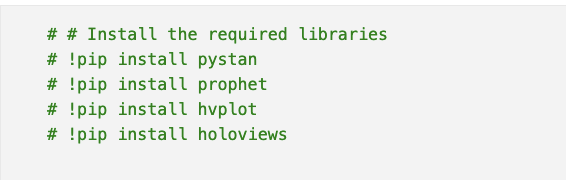
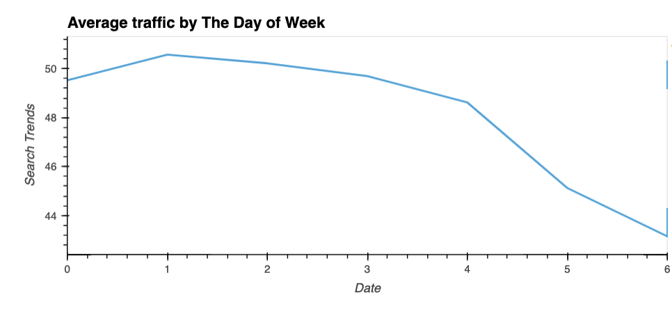

# Project Description
You’re a growth analyst at [MercadoLibre](http://investor.mercadolibre.com/investor-relations). With over 200 million users, MercadoLibre is the most popular e-commerce site in Latin America. You've been tasked with analyzing the company's financial and user data in clever ways to make the company grow. So, you want to find out if the ability to predict search traffic can translate into the ability to successfully trade the stock.

Instructions

This section divides the steps for this Project, as follows:

* Step 1: Find unusual patterns in hourly Google search traffic

* Step 2: Mine the search traffic data for seasonality

* Step 3: Relate the search traffic to stock price patterns

* Step 4: Create a time series model with Prophet

* Step 5: Forecast revenue by using time series models

# Outline
- [ 1 - Search Traffic ](#1)
- [ 2 - Search Data For Seasonality ](#2)
- [ 3 - How Search Traffic relates to Stock Price](#3)
- [ 4 - Time Series Model](#4)
- [ 5 - Forecast Revenue](#5)

## Packages and Requirements
In order to run the code make sure you are in the `dev` environment. To create a `dev` enviroment that runs python 3.7, go to your terminal and:
`conda create -n dev python=3.7 anaconda`
Once the enviroment is created just go to your terminal and type `conda activate dev` and to deactivate enviroment, `conda deactivate dev`.
If you have any running the code, please go to the `requirements.txt` file and make sure to install the require packages and libraries as follow;

# 1 - Search Traffic
The first part of my analysis I compared the search traffic for the month of May, 2020. On the image below, we can see the data for that; 

* When I added all the search traffic for the month of May, I came across the result of 38181 search trends. When compared to the average monlty search traffic of 35172.2. May was a month with more traffic then usual. There was an increase of roughly 8% for the month of May.

# 2 - Search Data For Seasonality
This part of the analysis, I first group the hourly data to plot the average traffic by the day of the week

If we Analye the graph above, we can see that most of the traffic happens from Monday-Wednesday. I investigated even more and analyze the traffic based on the hours, and here are the results;

There is clearly a trend where at the early hours there is more traffic. During 5-10 there is clearly a decline in traffic and then the ttraficc picks up again later. By 20 hours, it is where there is more traffic. When we analyze by the days, the pattern is pretty clear, the week start off with a pretty heavy traffic and by the fifth day the traffic slows down.

And finally I took a macro look at the data, when I plotted the average traffic by week of the year;

And to conclude the first part of the analysis, I was able to identified that during week 42 there is a big spike and the traffic keeps increasing until it reaches week 51. By week 52 there is a huge decrease of traffic. I have to belive that more people are back to their normal routines and have less time to spend on the internet.

# 3 - How Search Traffic relates to Stock Price
By the end of February,2020 the stock price suffered a big decrease and at the same time the search trends also suffered a huge decrease. At the same time, when there is an increase of the stock price in mid May, there is also an increase of search trends. There is a correlation between Stock price/Search trends.

# 4 - Time Series Model

With Prophet, I ran a model prediction in order to forecast the near-term for the popularity of MercadoLibre. I was able to identified that the near-term for the popularity of MercaboLibre will decrease heading into the final months of 2020. Besides that, I identified what time of the day shows the greatest popularity, following by which day of the week and lastly the lowesr point for search traffic in the calendar year. 

To conclude this part of the analysis, these were the conclusions made by the plots above;

* Time of the day with the greatest popularity: 00:00 or 12:00 AM
* Day of the week that gets the most search traffic: Monday-Tuesday
* Lowest point for search traffic in the calendar year: End of September

# 5 - Forecast Revenue

The final part of the analysis was to predict the revenue for the upcoming quarter. Based on my analysis, I came up with the possible scenarios that could happen;
* Best Case roughly around $1 billion. 
* Worst Case roughly around $886 million. 
* Most likely case roughly around $969 million.
